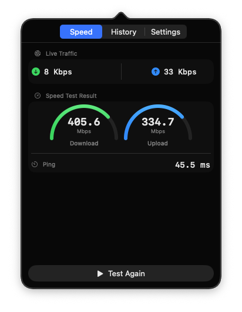

# NetPulse

<p align="center">
  
</p>

A native macOS menu bar app that monitors your **internet speed** in real time and runs **Cloudflare-powered speed tests** with one click.

<p align="center">
  
</p>

## Features

- **Live Speed in Menu Bar** — Real-time upload/download speed displayed right in your menu bar.
- **Speed Test** — Cloudflare-powered download, upload, and latency measurement with progressive payloads.
- **Test History** — All results saved locally with SQLite, viewable anytime.
- **Menu Bar Native** — Lives in your macOS menu bar, one click to open.
- **Lightweight** — ~1MB universal binary (arm64 + x86_64), zero external dependencies.
- **Local-First** — All data stays on your device. No servers, no telemetry.

## Install

1. Clone the repo
2. Open `NetPulse.xcodeproj` in Xcode
3. Build & Run (Cmd+R)

```bash
git clone https://github.com/tansuasici/NetPulse.git
cd NetPulse
open NetPulse.xcodeproj
```

Requires macOS 13.0 (Ventura) or later and Xcode 15+.

## How It Works

### Live Monitoring
1. Reads macOS network interface byte counters (`getifaddrs`) every second
2. Filters to physical interfaces only (`en*`) to avoid VPN/tunnel double counting
3. Displays current speed in the menu bar as `↓X ↑Y`

### Speed Test
1. Connects to Cloudflare's edge network (`speed.cloudflare.com`)
2. Measures latency (median of 5), download (progressive 100KB–25MB), and upload (progressive 100KB–10MB)
3. Reports 90th percentile (p90) for realistic results
4. Uses ephemeral URLSession — no cache, no cookie, no keep-alive bias

## Privacy

All data stays on your device. NetPulse:
- Does **not** send data to any server (other than `speed.cloudflare.com` for speed tests you initiate)
- Does **not** collect analytics or telemetry
- History is stored locally in `~/Library/Application Support/NetPulse/`

## License

MIT
